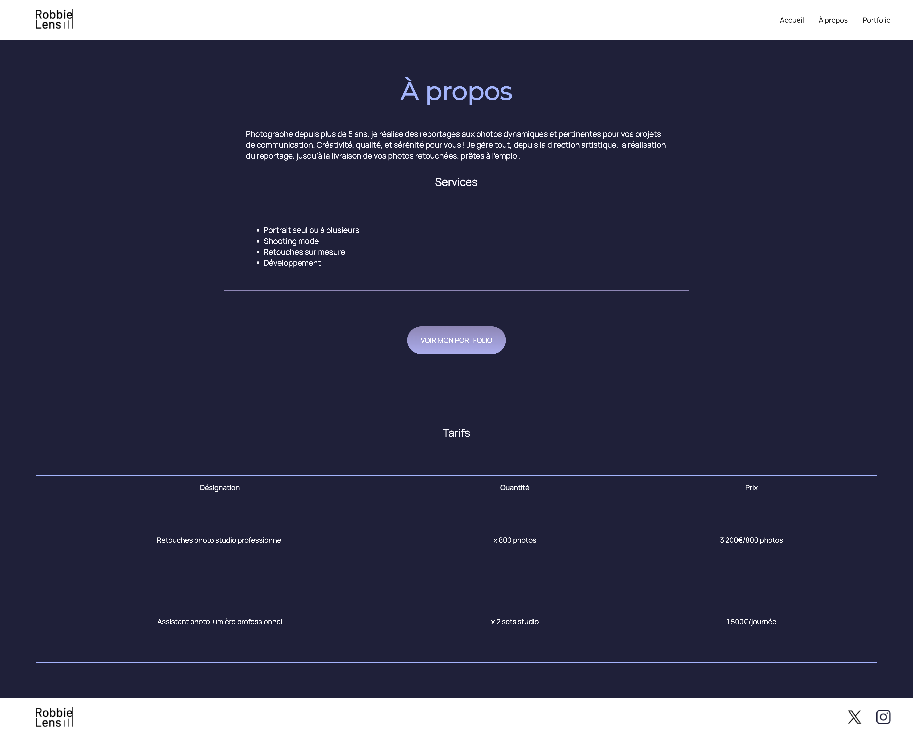

# com.Robbie-Lens-Portfolio.Html.CSS
Creating a full responsive photographer's portfolio.    
Frontend project HTML/CSS  

Webdesign and effects using Flexbox, CSS Grid, Hover and Media Queries.

Mobile and desktop mock-up using Figma

## Home page :

1. header : Logo Robbie Lens and navbar links
2. Welcome intro and call to action
3. Overview of the latest project
4. Contact form : Name / Email / Message / CTA 
5. Footer : Logo RL and social media links (X, Instagram)

## About page :

1. About Robbie Lens introduction, services list and call to action 
2. Tariffs table : Services / Quantity / Prices

 

## Portfolio page :

1. Photo gallery :  
   Grid Landscapes 3 columns / 3 rows with hover effects
2. Photo gallery :  
   Grid Portraits 3 columns / 2 rows with hover effects
   

### Thanks to :

* Robbie Lens
* Mathieu Nebra
* OpenClassrooms
* MDN
* CodePen
* Flexbox Froggy

***Stay curious & keep learning !***  :man_technologist:  
*05/2025 by Dev-Ninja75 from Paris with luv* 
